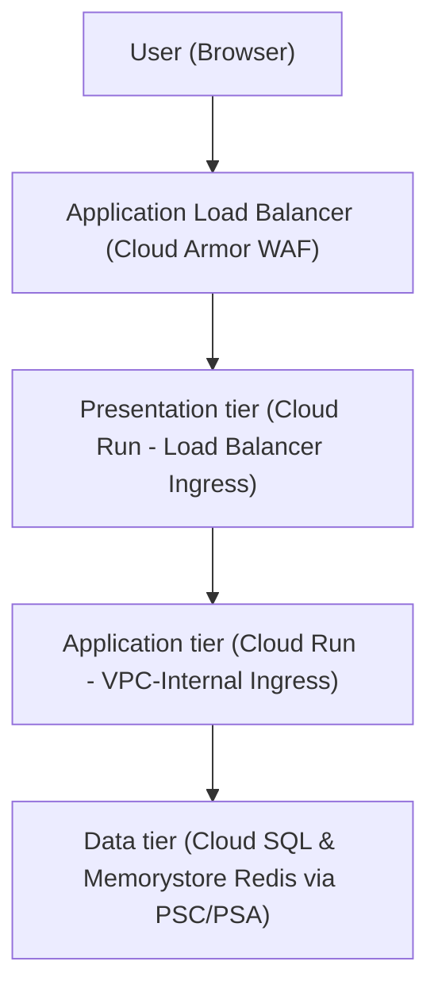

<!-- Use this template to compile the solution architecture and code generated
based on the instructions in SKILL.md. -->
<!-- disableFinding(all) -->
<!-- mdlint off -->

# Google Cloud solution architecture: [Workload Name]

Note: Standalone text or instructions enclosed between [ and ] (e.g., [Workload Name] or [Paste code here]) represent placeholder instructions or sample text that are replaced by the agent when populating this template.

## 1. Executive summary and workload overview

[A brief description of the workload, its business goals, and the high-level
N-Tier (multi-tier) serverless solution architecture proposed across your
compute and data tiers.]

## 2. Requirements and current state

### 2.1. Functional requirements

*   **Business processes**: [Details of the business processes supported]
*   **Activities and use cases**: [Details of the key activities and use cases]

### 2.2. Non-functional requirements

*   **Security & Zero-Trust**: [Details of security requirements including
    single-domain reverse proxy, WAF mitigation, VPC-internal ingress
    isolation (`INGRESS_TRAFFIC_INTERNAL_ONLY`), and optional VPC Service
    Controls]
*   **Reliability & Availability**: [Details of reliability constraints, SLA
    targets, auto-scaling concurrency, and multi-zone regional high
    availability]
*   **Cost**: [Details of cost constraints, serverless $0 idle cost preferences
    (`ALL_TRAFFIC` + PGA vs internal Application Load Balancer), and pricing models]
*   **Operations & Observability**: [Details of monitoring, structured logging,
    database Query Insights, and continuous deployment requirements]
*   **Performance**: [Details of latency, connection pooling, Cloud CDN caching,
    and Memorystore Redis caching requirements]
*   **Sustainability**: [Details of serverless resource optimization and carbon
    footprint reduction strategies]

### 2.3. Current state

[If applicable, describe the current on-premises, legacy v1 Cloud Run, or
other-cloud architecture.]

*   **Current infrastructure**: [Details of existing setup]
*   **Pain points and drivers for migration/redesign**: [Details of drivers for
    migration/redesign]

### 2.4. Dependencies

*   **Internal dependencies**: [Details of internal dependencies including
    existing VPCs, domain names, and downstream APIs]
*   **External dependencies**: [Details of third-party SaaS products and
    on-premises tools]

## 3. Technical decomposition of the workload

[Decompose the workload into distinct logical tiers across the request
lifecycle, ensuring strict security boundary segregation:]

*   **Tier 1 presentation tier (frontend / reverse proxy)**: Public-facing UI
    rendering and gateway proxy service
    (`google_cloud_run_v2_service.frontend`). Ingress restricted strictly to
    Application Load Balancer (`INGRESS_TRAFFIC_INTERNAL_LOAD_BALANCER`).
*   **Tier 2..N application tier (internal microservices / business logic)**:
    1 to N internal business logic services
    (`google_cloud_run_v2_service.backend_application`, `orders_service`, etc.). Ingress
    restricted strictly to VPC-internal (`INGRESS_TRAFFIC_INTERNAL_ONLY`).
*   **Data tier (persistent database and in-memory cache)**: Private relational
    database (`Cloud SQL PostgreSQL 18 Enterprise Edition` with `database_version = "POSTGRES_18"`, Regional HA `availability_type = "REGIONAL"`, and `Private Service Connect` configuration `psc_enabled = true, ipv4_enabled = false`) and cache
    (`Memorystore Redis` via `Private Services Access`).
*   **Shared security and lifecycle tiers**: Container image management
    (`Artifact Registry`), secret credentials (`Secret Manager`), private internal DNS resolution (`Cloud DNS Managed Private Zone` for `run.app.`), and zero-trust
    egress firewalls (`VPC Egress Firewalls`).

## 4. Proposed solution architecture

### 4.1. Google Cloud products and features mapping

[Map your confirmed decomposition directly to Google Cloud products based on
Section 11 ("Comprehensive product mapping specifications") inside `references/related-guidance.md`. Justify every selection and note
trade-offs:]

[Populate the following table with the appropriate content at runtime.]

| Component | Recommended Google Cloud product/feature | Justification and citations | Alternatives considered | Pros and cons of alternatives |
| :--- | :--- | :--- | :--- | :--- |

### 4.2. Architecture diagram

[Mermaid architecture flowchart illustrating the request and data flow across public and private tiers:]



### 4.3. Architecture description

*   **Data flow**: [Describe the secure request and data payload lifecycle from
    edge entry point `https://domain.com` through tier 1 reverse proxying,
    internal microservice processing, and persistent database/cache storage.]
*   **Tasks/control flow**: [Describe container startup authentication,
    least-privilege IAM service account execution (`roles/run.invoker`,
    `roles/cloudsql.client`), and Cloud SQL sidecar socket connections.]

## 5. Design and configuration recommendations

[Populate the following subsections to match your generated recommendations.
The current text is for example only.]

### 5.1. Security, privacy, and compliance

[Populate the following subsections to match your generated recommendations.
The current text is for example only.]

*   **Edge WAF Protection (Cloud Armor / `google_compute_security_policy`)**: This design implements and attaches a **Cloud Armor Web Application Firewall (`WAF`) security policy** (`google_compute_security_policy`) with preconfigured SQL injection (`sqli-v33-stable`) and XSS protection rules to your global or regional external Application Load Balancer backend service to screen and block malicious internet ingress before it reaches serverless compute tiers. When deploying a regional external Application Load Balancer, an explicit proxy-only subnet (`purpose = "REGIONAL_MANAGED_PROXY"`) is provisioned in the VPC and `network` must be specified on the regional forwarding rule.
*   **Reverse Proxy & CORS Elimination**: Routing all requests through
    the single Presentation domain (`Tier 1 Frontend`) hides internal
    microservices (`Tiers 2..N`) from the internet and avoids browser CORS
    preflight complexity.
*   **Ingress Bypass Gotcha & Edge Protection (`internal-and-cloud-load-balancing`)**:
    > [!WARNING]
    > **Critical Ingress Bypass Gotcha**: If a public Cloud Run service is not explicitly restricted at the ingress level, external attackers can completely bypass your Application Load Balancer and Cloud Armor WAF security policies (`sqli-v33-stable`) by sending HTTP requests directly to the default `*.run.app` URL. To eliminate this critical security bypass risk, this design configures the Tier 1 frontend ingress to **`internal-and-cloud-load-balancing`** (`INGRESS_TRAFFIC_INTERNAL_LOAD_BALANCER`), and all intermediate/internal microservice tiers (`Tiers 2..N`) strictly to **`internal`** (`INGRESS_TRAFFIC_INTERNAL_ONLY`).
*   **Zero Public Exposure, VPC-Internal Ingress (`INGRESS_TRAFFIC_INTERNAL_ONLY`), & Cloud DNS (`google_dns_managed_zone`)**: While many designs casually refer to intermediate microservices or the backend application as "private", to make them genuinely private across serverless architectures, this design configures the backend application service ingress strictly to **`VPC-internal` (`INGRESS_TRAFFIC_INTERNAL_ONLY`)**. Furthermore, because `BACKEND_URL` (`*.a.run.app`) resolves via public Google DNS to public IPv4 VIPs (`216.58.x.x`) by default — causing packets via `ALL_TRAFFIC` egress to hit the `deny_all_egress` firewall or fail `VPC-internal` ingress requirements — this design configures a **Cloud DNS Managed Private Zone (`google_dns_managed_zone`) for `run.app.` bound to `vpc_network` with `google_dns_record_set` mapping `*.run.app` directly to Private Google Access VIPs (`199.36.153.4/30 / 199.36.153.8/30`)**. This guarantees that all downstream internal microservice tiers (T2..TN) resolve securely to internal PGA endpoints, maintaining zero public internet exposure.
*   **Least-Privilege VPC Egress Firewall Rules & Sidecar IAM Cert Exchange (`443`)**: This design enforces **least-privilege VPC Egress Firewall rules (`google_compute_firewall`) to restrict traffic precisely between tiers**. It enforces a default-deny VPC Egress policy (`0.0.0.0/0`) on the Cloud Run subnet (`priority = 65534`), and adds explicit allow rules so Tier 1 (`frontend`) can only egress to Tier 2 (`backend application`) (`port 443/8080` along with Private Google Access VIPs `199.36.153.4/30` and `199.36.153.8/30`), and backend application can only egress (`allow_backend_db_egress`) to the Data Tier (`Cloud SQL port 5432` / `Redis port 6379`) AND Private Google Access VIPs (`port 443` on `199.36.153.4/30 / 199.36.153.8/30`). Permitting outbound TCP port `443` to PGA VIPs alongside port `5432` is critical: when Cloud Run initializes `cloud_sql_instance` volumes (`IAM Auth`), the sidecar queries `sqladmin.googleapis.com` (`port 443`) and OAuth endpoints to exchange tokens for ephemeral client certificates on startup; blocking this traffic causes the sidecar cert exchange to crash.
*   **Cloud SQL Auth Proxy & IAM-Based Database Authentication (`DB_SOCKET_PATH`)**: This design includes the **Cloud SQL Auth Proxy** (run via Unix socket volume sidecar `/cloudsql/project:region:instance`) and **IAM-based database authentication** (`cloudsql.iam_authentication = on`) using short-lived IAM OAuth tokens (`roles/cloudsql.client` via `google_sql_user`) rather than hardcoded database passwords. Note that because the Auth Proxy sidecar queries `sqladmin.googleapis.com` (`443`) over PGA VIPs during container startup for IAM certificate exchange, `allow_backend_db_egress` explicitly permits TCP port `443` to `199.36.153.4/30, 199.36.153.8/30`. When configuring database connection strings in application drivers, **`DB_SOCKET_PATH` (`/cloudsql/...` Unix socket) is recommended over direct TCP (`DB_PSC_ENDPOINT`) as the primary/default path**, since the Auth Proxy sidecar automatically handles transparent IAM authentication, short-lived OAuth token refresh, and mutual TLS without requiring password rotation or custom token acquisition code.
*   **Optional VPC Service Controls (`enable_vpc_sc`)**: Wraps
    `run.googleapis.com`, `sqladmin.googleapis.com`, and
    `secretmanager.googleapis.com` in an Org-level VPC Service Controls service
    perimeter when `enable_vpc_sc = true` to eliminate API data exfiltration risks.

### 5.2. Reliability

[Populate the following section to match your generated recommendations.
The current text is for example only.]

*   **Cloud SQL PostgreSQL Regional HA (`availability_type = "REGIONAL"`) & Private Service Connect (`psc_enabled = true, ipv4_enabled = false`)**: This design provisions **Cloud SQL for PostgreSQL Enterprise Edition** (`85`) with **Regional High Availability** (`availability_type = "REGIONAL"`, ~60s failover across zones). Furthermore, it enforces an exact Private Service Connect and zero public IP configuration (`psc_enabled = true, ipv4_enabled = false`, `google_compute_forwarding_rule`) (`100% private, zero public IP exposure`).
*   **Redundant Serverless Deployment**: Cloud Run v2 automatically distributes
    container ingress across multiple physical zones within the target region
    (`var.region`).
*   **Auto-Scaling Boundaries**: Configure appropriate minimum and maximum
    container instance counts (`scaling.min_instance_count` /
    `max_instance_count`) to guarantee RTO/RPO targets and eliminate cold-start
    latency spikes on critical business logic tiers.

### 5.3. Operational excellence

[Populate the following section to match your generated recommendations.
The current text is for example only.]

*   **Structured JSON Logging & Error Reporting**: Emit structured JSON logs
    from all container runtimes to populate native `jsonPayload` fields in `Logs
    Explorer` and automatically trigger unhandled exception groupings in `Cloud
    Error Reporting`.
*   **VPC Flow Logs & Cost-Optimized Sampling (`log_config`)**: This design configures VPC Flow Logs on the shared Cloud Run subnet with a cost-optimized baseline capture rate of **`10%` (`flow_sampling = 0.1`)** and an aggregation window of **`1 minute` (`aggregation_interval = "INTERVAL_1_MIN"`)**. If your security or operations team requires higher network visibility and forensic granularity, you can increase `flow_sampling` up to `1.0` (100% of traffic) and shorten `aggregation_interval` across your Terraform variables. Conversely, if you are in a cost-sensitive development environment and do not need network flow auditing, you can disable flow logs and all optional observability tools entirely by setting `enable_monitoring = false`.
*   **Database Deep Observability**: Enable **Cloud SQL Query Insights**
    (`query_insights_enabled = true`) to continuously audit query execution
    plans, measure lock contention, and detect N+1 query anomalies across app
    workloads.
*   **Proactive Uptime Checks**: Provision global **Cloud Monitoring Uptime
    Checks** (`/healthz`) targeting the Application Load Balancer custom domain every 60 seconds to
    detect presentation anomalies before users experience failures.
*   **Infrastructure as Code (IaC)**: Manage all infrastructure using modular,
    version-controlled `Terraform` (`assets/main.tf`) with stateful deletion
    protection enabled on critical storage blocks (`deletion_protection =
    true`).

### 5.4. Cost optimization

[Populate the following section to match your generated recommendations.
The current text is for example only.]

*   **Serverless Idle Efficiency ($0 Baseline)**: By defaulting internal compute
    routing to `egress = "ALL_TRAFFIC"` + Private Google Access
    (`private_ip_google_access = true`) alongside a Cloud DNS Managed Private Zone (`google_dns_managed_zone`) for `run.app.`, the architecture operates with $0 fixed
    internal proxy overhead when idle, avoiding costly intermediate internal
    Application Load Balancers unless multi-region failover or custom internal SSL
    certificates are required.
*   **Right-Sizing & Spot/Allocations**: Optimize Cloud Run `limits` (`memory`
    and `cpu`) per tier, and use `enable_cdn = true` on the Application Load Balancer to offload
    static asset delivery to Google's edge caching tier.

### 5.5. Performance efficiency

[Populate the following section to match your generated recommendations.
The current text is for example only.]

*   **Connection Pooling**: Implement database connection pooling inside Tiers
    2..N microservices to prevent PostgreSQL connection exhaustion under rapid
    serverless auto-scaling events.
*   **Sub-Millisecond Caching**: Use Memorystore for Redis (`connect_mode =
    "PRIVATE_SERVICE_ACCESS"`) to offload user session validation, JWT
    verification, or frequent read queries.

### 5.6. Sustainability

[Populate the following section to match your generated recommendations.
The current text is for example only.]

*   Adopting 100% serverless runtimes (`Cloud Run`) ensures compute resources
    scale precisely to zero (`0 instances`) during idle periods, maximizing
    datacenter hardware utilization and reducing overall carbon footprint.

## 6. Deployment guidance

[The following steps are samples only. Provide complete, actionable deployment instructions, your generated modular
Terraform code, and your generated cross-platform verification scripts below.]

### 6.1. Step-by-step deployment instructions

*   **Zero-Install Environment Recommendation**: For immediate deployment
    without local SDK installations, run all steps below inside **Google Cloud
    Shell** (`https://shell.cloud.google.com`), where `terraform`, `python3`,
    `gcloud`, and `git` are 100% pre-installed and authenticated out of the box.

1.  **Select Google Cloud Project and Enable APIs**:
    ```bash
    gcloud config set project [YOUR_PROJECT_ID]
    gcloud services enable run.googleapis.com sqladmin.googleapis.com redis.googleapis.com \
        servicenetworking.googleapis.com secretmanager.googleapis.com monitoring.googleapis.com \
        dns.googleapis.com
    ```

2.  **Initialize and Apply Modular Terraform Configuration**:
    ```bash
    terraform init
    terraform apply
    ```
3.  **Optional VPC Service Controls (`enable_vpc_sc`) Configuration**: If
    deploying with `enable_vpc_sc = true`, ensure your active identity is an
    Organization Access Context Manager Admin and update your service perimeter
    to include the newly deployed project and required APIs before starting
    containers.

### 6.2. Modular infrastructure as code (`main.tf`)

[Embed your complete, deploy-ready Terraform (`main.tf`) code generated from
`assets/main.tf` below, containing Section 5.1 ("Tier 1 presentation tier: frontend reverse proxy") and
replicated Section 5.2 ("Tier 2 application tier: private backend API") building blocks inside `assets/main.tf`
tailored to the user's workload, ensuring `database_version = "POSTGRES_18"` is strictly preserved:]

```hcl
# [Paste complete deploy-ready generated main.tf HCL code here]
```

### 6.3. Step-by-step `gcloud` CLI deployment commands

[Replace the following sample code with the complete sequence of `gcloud` CLI commands required to deploy this exact three-tier architecture manually from the terminal. Ensure the sequence executes in strict **bottom-up deployment order** (`internal data tier -> internal microservices -> public presentation gateway -> external Application Load Balancer`), enforces `--database-version=POSTGRES_18` for Cloud SQL, and captures dynamic downstream URLs into shell variables to automatically pass them inside `--update-env-vars`:]

```bash
# 1. Create VPC network and private subnet with Private Google Access enabled
[gcloud command to create a VPC network]
[gcloud command to create a subnet]

# 2. Provision data tier (Private Cloud SQL instance with Public IP disabled & Private Redis)
[gcloud command to create a Cloud SQL instance with --database-version=POSTGRES_18 --no-assign-ip --enable-private-service-connect ...]
[gcloud command to create a Redis instance]

# 3. Deploy internal application tier service (strictly VPC-internal ingress & Direct VPC Egress)
[gcloud command to create an application tier service]

# 4. Extract generated internal application tier URL into shell variable for service wiring
[shell command to extract an application tier URL]

# 5. Deploy presentation tier frontend service with load balancer-only ingress, injecting BACKEND_URL right into environment variables
[gcloud command to deploy the presentation tier service]

# 6. Create Serverless NEG and attach to external Application Load Balancer with Cloud Armor WAF
[gcloud command to create a serverless NEG]
# [Paste remaining gcloud compute backend-services / url-maps / target-https-proxies commands here]
```

### 6.4. Solution verification guide and custom automated validation script

[Embed your custom automated validation script (e.g., self-contained
cross-platform Python script using standard `urllib` / `subprocess` or
cross-platform shell script) generated per Phase 4 validation steps across SSL
provisioning, Tier 1 ingress blocking, Tier 2..N internal VPC ingress blocking,
Application Load Balancer reachability, and Cloud Armor WAF SQLi interception:]

```python
# [Paste custom generated verification script code here]
```

*   **Execution Commands**:
  ```bash
  python3 validate.py <custom_domain> <ssl_cert_name> <frontend_run_url> [internal_run_url_1 ...]
  ```

## 7. References

*   [Google Cloud Architecture Framework](https://docs.cloud.google.com/architecture/framework.md.txt)
*   [Cloud Run Direct VPC Egress](https://docs.cloud.google.com/run/docs/configuring/vpc-direct-vpc.md.txt)
*   [Private Service Connect for Cloud SQL](https://docs.cloud.google.com/sql/docs/postgres/configure-private-service-connect.md.txt)
*   [Google Cloud Terraform Best Practices](https://docs.cloud.google.com/docs/terraform/best-practices/general-style-structure.md.txt)