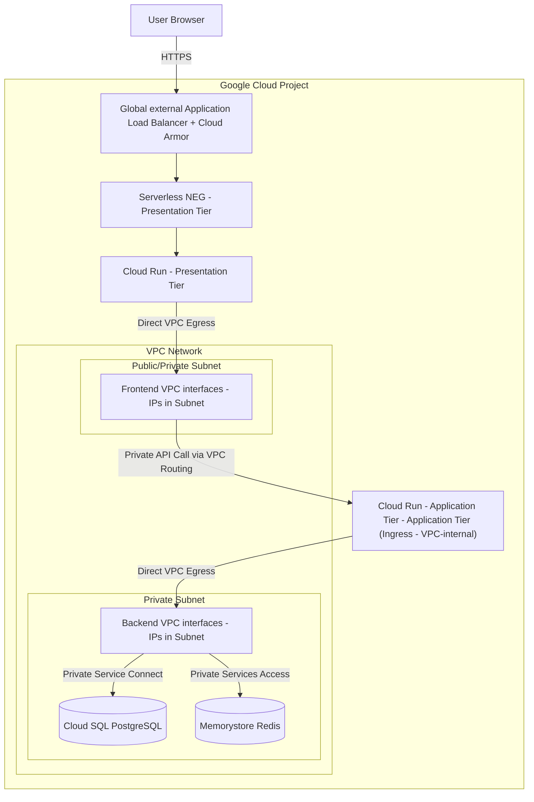

<!-- disableFinding(all) -->
<!-- mdlint off -->

# Architectural reference: secure serverless three-tier web application

This document provides deep technical guidance and architectural best practices for deploying a secure, highly available, n-tier (multi-tier) serverless web application on Google Cloud. 

The architecture enforces strict physical and network isolation between the tiers:
1.  **Presentation tier**: Public-facing UI rendering and reverse-proxy service (Cloud Run).
2.  **Application tier**: Private business logic service (Cloud Run), reachable only from the VPC.
3.  **Data tier (database and cache)**: Private persistent storage (Cloud SQL) and in-memory caching (Memorystore Redis), reachable only from the application tier.

---

## Table of Contents

* **[1. Strict three-tier architecture overview](#1-strict-three-tier-architecture-overview)** *(Lines 56–90)*
* **[2. Ingress and routing: external vs. internal](#2-ingress-and-routing-external-vs-internal)** *(Lines 91–105)*
  * [Presentation tier ingress](#presentation-tier-ingress) *(Lines 93–97)*
  * [Application tier ingress](#application-tier-ingress) *(Lines 98–105)*
* **[3. Least-privilege network egress and VPC firewalls](#3-least-privilege-network-egress-and-vpc-firewalls)** *(Lines 106–116)*
* **[4. Caching tier: Memorystore for Redis (optional)](#4-caching-tier-memorystore-for-redis-optional)** *(Lines 117–132)*
  * [Redis deployment and security](#redis-deployment-and-security) *(Lines 123–132)*
* **[5. Secure database access: Private Service Connect and Cloud SQL Auth Proxy](#5-secure-database-access-private-service-connect-and-cloud-sql-auth-proxy)** *(Lines 133–142)*
* **[6. Security and operational best practices](#6-security-and-operational-best-practices)** *(Lines 143–160)*
  * [Presentation tier as a reverse proxy](#presentation-tier-as-a-reverse-proxy) *(Lines 145–150)*
  * [Secrets management](#secrets-management) *(Lines 151–153)*
  * [Optional VPC Service Controls perimeter](#optional-vpc-service-controls-perimeter) *(Lines 154–160)*
* **[7. Content delivery network (Cloud CDN) (optional)](#7-content-delivery-network-cloud-cdn-optional)** *(Lines 161–172)*
  * [How it works and trade-offs](#how-it-works-and-trade-offs) *(Lines 165–172)*
* **[8. Load balancer topology: global vs. regional](#8-load-balancer-topology-global-vs-regional)** *(Lines 173–212)*
  * [Comparison and trade-offs](#comparison-and-trade-offs) *(Lines 177–187)*
  * [Why choose a regional Application Load Balancer? (compliance and data residency)](#why-choose-a-regional-application-load-balancer-compliance-and-data-residency) *(Lines 188–192)*
  * [Regional proxy-only subnet and network parameter requirements](#regional-proxy-only-subnet-and-network-parameter-requirements) *(Lines 193–197)*
  * [Terraform resource mapping (global to regional)](#terraform-resource-mapping-global-to-regional) *(Lines 198–212)*
* **[9. Observability and monitoring (optional)](#9-observability-and-monitoring-optional)** *(Lines 213–253)*
  * [9.1 VPC Flow Logs (Network Auditing)](#91-vpc-flow-logs-network-auditing) *(Lines 219–224)*
  * [9.2 Firewall Rules Logging (Network Access Auditing)](#92-firewall-rules-logging-network-access-auditing) *(Lines 225–231)*
  * [9.3 Load Balancer Access Logs (Application Ingress Auditing)](#93-load-balancer-access-logs-application-ingress-auditing) *(Lines 232–237)*
  * [9.4 Cloud Monitoring Alerting Policies (Proactive Operations)](#94-cloud-monitoring-alerting-policies-proactive-operations) *(Lines 238–242)*
  * [9.5 Advanced industry observability checklist (production best practices)](#95-advanced-industry-observability-checklist-production-best-practices) *(Lines 243–253)*
* **[10. Container image storage and deployment strategy (Artifact Registry)](#10-container-image-storage-and-deployment-strategy-artifact-registry)** *(Lines 254–285)*
  * [Recommended storage: Artifact Registry](#recommended-storage-artifact-registry) *(Lines 258–263)*
  * [Deployment strategy: pre-existing images vs. initial bootstrapping](#deployment-strategy-pre-existing-images-vs-initial-bootstrapping) *(Lines 264–279)*
  * [Other service patterns](#other-service-patterns) *(Lines 280–285)*
* **[11. Comprehensive product mapping specifications](#11-comprehensive-product-mapping-specifications)** *(Lines 286–307)*
  * [11.1 Public ingress and WAF](#111-public-ingress-and-waf) *(Lines 290–294)*
  * [11.2 Compute tier (Cloud Run v2 with Direct VPC Egress)](#112-compute-tier-cloud-run-v2-with-direct-vpc-egress) *(Lines 295–300)*
  * [11.3 Data tier and secrets (`100% private, zero public IP exposure`)](#113-data-tier-and-secrets-100-private-zero-public-ip-exposure) *(Lines 301–307)*
* **[12. Architectural design trade-offs and rationale](#12-architectural-design-trade-offs-and-rationale)** *(Lines 308–318)*
  * [12.1 Single-domain reverse-proxy pattern and CORS elimination](#121-single-domain-reverse-proxy-pattern-and-cors-elimination) *(Lines 310–312)*
  * [12.2 Ingress bypass gotcha vs. Application Load Balancer enforcement](#122-ingress-bypass-gotcha-vs-application-load-balancer-enforcement) *(Lines 313–315)*
  * [12.3 Container image lifecycle decoupling](#123-container-image-lifecycle-decoupling) *(Lines 316–318)*

---

## 1. Strict three-tier architecture overview

In this strict model, the **Application Tier** is completely private and has no public internet presence. The Presentation tier acts as the gatekeeper. The user's browser only communicates with the Presentation tier, which in turn communicates with the Application tier over the private VPC network.



---

## 2. Ingress and routing: external vs. internal

### Presentation tier ingress
*   **External Entry Point**: Exposed via a **global external Application Load Balancer** or **regional external Application Load Balancer** with **Cloud Armor** WAF protection.
*   **CDN Caching**: **Cloud CDN** is enabled on the Application Load Balancer backend service to cache static assets (HTML, JS, CSS, images) at the edge, reducing compute load on the Presentation Tier.
*   **Ingress Bypass Protection**: Ingress is restricted to `internal-and-cloud-load-balancing` to ensure all public traffic must pass through Cloud Armor.

### Application tier ingress
*   **Zero Public Exposure**: Ingress is set strictly to **VPC-internal** (`INGRESS_TRAFFIC_INTERNAL_ONLY`). The Application Tier has no public URL and cannot be reached from the internet.
*   **Private VPC Routing (`*.run.app` vs. internal Application Load Balancer)**: Because the Application Tier's ingress is restricted to VPC-internal, any request targeting its default `*.run.app` URL must arrive via the VPC to be recognized as internal (`INGRESS_TRAFFIC_INTERNAL_ONLY`). However, `BACKEND_URL` (`*.a.run.app`) resolves via public Google DNS to public IPv4 VIPs (`216.58.x.x`) by default. Under `egress = "PRIVATE_RANGES_ONLY"`, traffic from the Presentation Tier to public IPs (`*.run.app`) bypasses the VPC and exits directly to the internet, causing the Backend to reject the request with a 403 or 404 error. Furthermore, when the Presentation Tier uses `egress = "ALL_TRAFFIC"`, packets destined for that public VIP (`216.58.x.x`) hit the `deny_all_egress` firewall (which blocks `0.0.0.0/0`) OR fail at the backend because its ingress requires VPC-internal traffic. To satisfy this routing requirement and pass egress firewalls safely, the Presentation Tier (and any upstream service calling an internal `*.run.app` URL) must either:
    1. Use `egress = "ALL_TRAFFIC"` combined with enabling Private Google Access (`private_ip_google_access = true`) on the subnet, configuring VPC egress firewalls (`google_compute_firewall`) to allow Google API VIP ranges (`199.36.153.4/30`, `199.36.153.8/30`), **and deploying a Cloud DNS Managed Private Zone (`google_dns_managed_zone`) for `run.app.` bound to `vpc_network` that maps `*.run.app` directly to Private Google Access VIPs (`199.36.153.4/30 / 199.36.153.8/30`)**. This ensures `BACKEND_URL` queries resolve to internal PGA VIPs inside the VPC, passing egress firewalls cleanly and delivering requests with internal VPC identity.
    2. Route traffic to the Backend privately using an internal Application Load Balancer, which allows keeping `egress = "PRIVATE_RANGES_ONLY"`.

---

## 3. Least-privilege network egress and VPC firewalls

We implement strict network-level isolation using **Direct VPC Egress** combined with zero-trust **VPC Egress Firewall Rules** (or Cloud NGFW policies):

*   **Default Egress Deny**: The Cloud Run subnets enforce a default-deny egress firewall policy (`destination_ranges = ["0.0.0.0/0"]`, low priority), ensuring serverless runtimes cannot reach unauthorized internal destinations or leak data to external IPs.
*   **Presentation Tier**: Enforces an explicit egress allow rule permitting the Presentation Tier service account to send traffic strictly to the Application Tier (permitting the Cloud Run subnet CIDR alongside Google API VIP ranges `199.36.153.4/30`, `199.36.153.8/30` when using Private Google Access and a Cloud DNS Managed Private Zone for `*.run.app` calls via `ALL_TRAFFIC`). It is **not** granted access to Data tier subnets or endpoints.
*   **Application Tier**: Configured with `egress = "PRIVATE_RANGES_ONLY"`, enforcing an explicit egress allow rule permitting the Backend service account to reach exclusively the local VPC Cloud SQL Private Service Connect endpoint (TCP 5432) and Memorystore Redis instance (TCP 6379).
*   **Firewall Rules Logging**: Each egress firewall rule supports optional Firewall Rules Logging (configured via `log_config` with `metadata = "INCLUDE_ALL_METADATA"` when `enable_monitoring` is true) to audit allowed and denied connections for security verification and compliance.

---

## 4. Caching tier: Memorystore for Redis (optional)

To reduce database load and improve API response times, the Application tier can **optionally** utilize **Memorystore for Redis** as a private caching tier. 

While not a hard requirement for the application to function, it is highly recommended for production workloads.

### Redis deployment and security
*   **Optional Optimization**: The architecture can be deployed without Redis. If omitted, the Application Tier simply queries Cloud SQL directly for all requests, reducing infrastructure costs.
*   **VPC Bound**: If deployed, Memorystore is provisioned with a private IP address within the VPC network.
*   **Authorized Network**: Access is restricted to the VPC. The Application Tier connects to the Redis instance's private IP and port (default `6379`) via its Direct VPC Egress.
*   **Use Cases**:
    *   **Session State**: Storing user sessions so the Application Tier remains stateless.
    *   **Query Caching**: Caching expensive database query results.

---

## 5. Secure database access: Private Service Connect and Cloud SQL Auth Proxy

The Application tier connects to the private Cloud SQL instance via a local **Private Service Connect** endpoint in the consumer VPC, protected by the **Cloud SQL Auth Proxy** sidecar container in the Application Tier Cloud Run service.

*   **Private Service Connect**: Unlike legacy Private Services Access peering, Private Service Connect provisions a single internal IP endpoint directly inside the customer VPC subnet. This eliminates IP CIDR exhaustion (`/16` requirements), avoids transitive peering restrictions across multi-VPC networks, and allows standard VPC egress firewall rules to restrict database connectivity.
*   **IAM-based Authorization**: Authorizes connections using the Backend service account's IAM identity, eliminating static passwords.
*   **Mutual TLS (mTLS)**: Encrypts all database traffic in transit automatically.

---

## 6. Security and operational best practices

### Presentation tier as a reverse proxy
By routing all API calls through the Presentation Tier server:
1.  **Hidden API Structure**: The internal API endpoints, schemas, and routing are completely hidden from the public internet.
2.  **Centralized Authentication**: The Presentation Tier can validate session cookies/tokens at the edge before forwarding requests to the Backend, protecting the Backend from unauthorized load.
3.  **Simplified Domain/CORS**: The browser only ever talks to one domain (the Presentation Tier). No CORS configuration is required.

### Secrets management
All database credentials, Redis connection strings, and API keys are stored in **Secret Manager** and mounted securely as environment variables in the Application Tier service.

### Optional VPC Service Controls perimeter
While Private Service Connect and VPC Egress Firewalls secure the network data plane (traffic to TCP 5432), **VPC Service Controls** can be optionally enabled to protect the API management plane (`sqladmin.googleapis.com`, `secretmanager.googleapis.com`, `run.googleapis.com`).
*   **Preventing API Data Exports**: Blocks API calls like `sqladmin.instances.export` aimed at copying database dumps to external Cloud Storage buckets outside the perimeter.
*   **Preventing External Credential Abuse**: Rejects API calls originating from unauthorized networks or untrusted devices even if legitimate IAM credentials are used.

---

## 7. Content delivery network (Cloud CDN) (optional)

For public-facing web applications, enabling **Cloud CDN** on the external Application Load Balancer is a highly effective, optional performance and cost-optimization control.

### How it works and trade-offs
*   **Edge Caching**: Cloud CDN caches static content (images, CSS, JS, media) at Google's global network edge.
*   **Cost Savings**: Cloud Run charges for CPU allocation and network egress. By serving static assets from the CDN cache, you bypass Cloud Run container activations and replace expensive serverless egress with much cheaper CDN egress fees.
*   **Toggling CDN**: The architecture supports turning CDN on or off via the `enable_cdn` boolean variable in Terraform. If disabled (e.g., if you have no static assets or use a third-party CDN like Cloudflare in front of the LB), the Load Balancer forwards all requests directly to the Presentation Tier container.
*   **Requirements**: Cloud CDN **requires a global Application Load Balancer**; it is not supported on regional Application Load Balancers.

---

## 8. Load balancer topology: global vs. regional

By default, this architecture recommends a **global external Application Load Balancer**. However, depending on compliance, data residency, and performance requirements, you can choose to deploy a **regional external Application Load Balancer**.

### Comparison and trade-offs

| Feature / Metric | Global external Application Load Balancer (Default) | Regional external Application Load Balancer (Alternative) |
| :--- | :--- | :--- |
| **Routing & Edge** | Anycast IP. Traffic enters Google's network at the nearest edge PoP globally and travels over Google's backbone. | Unicast IP. Traffic enters Google's network at the specific region's ingress point. |
| **SSL Termination** | Terminated at the global edge PoP closest to the user. | Terminated **strictly** within the designated Google Cloud region. |
| **Cloud CDN** | **Supported**. Native edge caching is available to drastically reduce Presentation Tier load and egress costs. | **Not Supported**. Static assets must be served directly from the Presentation Tier container. |
| **Subnet & Network Requirements** | No proxy-only subnet needed (`Google Anycast edge proxies handle routing`). Global forwarding rules (`google_compute_global_forwarding_rule`) do not require `network`. | **Requires an additional regional proxy-only subnet** (`google_compute_subnetwork` with `purpose = "REGIONAL_MANAGED_PROXY"`, `role = "ACTIVE"`) for Envoy proxies, and regional forwarding rules (`google_compute_forwarding_rule`) **must explicitly specify `network`**. |
| **Latency** | Lowest globally (Anycast routing + edge termination). | Higher for users far from the destination region. |
| **Primary Use Cases** | Public-facing websites, global audiences, workloads requiring edge caching (CDN), and standard web apps. | Strict compliance, data residency (e.g., GDPR, sovereign cloud where SSL keys/decryption must not leave a region), or strictly regional architectures. |

### Why choose a regional Application Load Balancer? (compliance and data residency)
The primary driver for choosing a regional Application Load Balancer is **compliance and data sovereignty**:
*   **SSL Decryption Boundary**: In a global Application Load Balancer, Google terminates SSL at its global edge locations. If your security policy or local regulations dictate that data must remain encrypted until it physically enters a specific geographic territory (e.g., Germany or the EU), a global Application Load Balancer cannot comply.
*   **Regional Isolation**: A regional Application Load Balancer ensures that all traffic processing, WAF (Cloud Armor) evaluation, and SSL decryption occur exclusively within the boundaries of the selected region.

### Regional proxy-only subnet and network parameter requirements
When deploying a regional external Application Load Balancer (`EXTERNAL_MANAGED`), Google runs Envoy proxies internally within your target region and VPC network. Because of this architectural difference from global Anycast routing:
1.  **Proxy-Only Subnet Required**: You must provision an additional explicit regional **proxy-only subnet** (`google_compute_subnetwork` with `purpose = "REGIONAL_MANAGED_PROXY"` and `role = "ACTIVE"`, e.g., `10.129.0.0/23`) inside the VPC network (`network = google_compute_network.vpc_network.id`) and region alongside your Cloud Run subnet. Managed Envoy proxies use IP addresses from this proxy-only subnet when establishing connections with target backends (such as Serverless NEGs).
2.  **Network Parameter on Forwarding Rule Required**: When creating the regional forwarding rule (`google_compute_forwarding_rule` with `load_balancing_scheme = "EXTERNAL_MANAGED"`), you **must explicitly specify the `network` parameter** (`network = google_compute_network.vpc_network.id`) alongside `region`, `ip_address`, `port_range`, and `target` to bind the load balancer forwarding rule directly to your VPC network and its proxy-only subnet.

### Terraform resource mapping (global to regional)
If a customer requires a regional Application Load Balancer, the Terraform resources must be swapped as follows:

| Global Resource (in `main.tf`) | Regional Equivalent Resource | Key Differences |
| :--- | :--- | :--- |
| *(None - New Resource Required)* | `google_compute_subnetwork` *(Proxy-Only Subnet)* | **Must provision an additional regional proxy-only subnet** (`purpose = "REGIONAL_MANAGED_PROXY"`, `role = "ACTIVE"`, e.g., `ip_cidr_range = "10.129.0.0/23"`) in the target `region` and `network` of your VPC for the regional Envoy proxy pool. |
| `google_compute_global_address` | `google_compute_address` | Add `region` parameter to the regional address. |
| `google_compute_backend_service` | `google_compute_region_backend_service` | Add `region` parameter. Note: `enable_cdn` is not supported on regional. |
| `google_compute_managed_ssl_certificate` | `google_compute_region_ssl_certificate` *(or Certificate Manager)* | Regional certificates must be provisioned in the specific region. |
| `google_compute_url_map` | `google_compute_region_url_map` | Add `region` parameter. |
| `google_compute_target_https_proxy` | `google_compute_region_target_https_proxy` | Add `region` parameter. |
| `google_compute_global_forwarding_rule` | `google_compute_forwarding_rule` | Add `region` parameter, set `load_balancing_scheme = "EXTERNAL_MANAGED"`, and **must explicitly specify `network = google_compute_network.vpc_network.id`** when creating regional managed forwarding rules. |

---

## 9. Observability and monitoring (optional)

To ensure operational excellence and rapid incident response, this architecture supports an optional **observability tier** that can be toggled on or off via a single configuration variable (`enable_monitoring`).

This tier implements the following distinct, high-value observability controls:

### 9.1 VPC Flow Logs (Network Auditing)
VPC Flow Logs record a sample of network flows sent from and received by VM interfaces and serverless VPC egress interfaces.
*   **Use Cases**: Network troubleshooting (e.g., verifying if tier-to-tier traffic is blocked), security forensics, and network load monitoring.
*   **Default Configuration**: Configured by default (`enable_monitoring = true`) on the Cloud Run subnet (`cloud_run_subnet`) with a cost-optimized capture rate of **`10%` (`flow_sampling = 0.1`)** over a **`1-minute` aggregation interval (`aggregation_interval = "INTERVAL_1_MIN"`)**.
*   **Cost Trade-off & Tuning**: Flow logs can generate massive volumes of data in high-traffic environments, leading to significant **Cloud Logging ingestion and storage costs**. You can increase `flow_sampling` up to `1.0` and shorten `aggregation_interval` if your security or diagnostics require more detailed packet flow data. Alternatively, if you do not need flow data or want zero observability ingestion costs during development, you can disable VPC Flow Logs along with other optional logging controls by setting `enable_monitoring = false`.

### 9.2 Firewall Rules Logging (Network Access Auditing)
Firewall Rules Logging records when a VPC firewall rule allows or denies traffic.
*   **Captured Data**: Connection 5-tuple (source/destination IP, source/destination port, protocol), action taken (ALLOW or DENY), rule name, and instance/service account metadata.
*   **Use Cases**: Verifying zero-trust egress policies (e.g., auditing any denied connection attempts from Cloud Run containers or verifying valid traffic to Cloud SQL and Redis), security compliance, and threat hunting.
*   **Cost Trade-off**: Like VPC Flow Logs, high-volume firewall logging can increase Cloud Logging ingestion volumes.
*   **Toggleable**: Controlled via the `enable_monitoring` variable by attaching a `log_config` block (`metadata = "INCLUDE_ALL_METADATA"`) to each firewall rule.

### 9.3 Load Balancer Access Logs (Application Ingress Auditing)
Load Balancer access logs capture detailed metadata for every HTTP request entering your application through the global external Application Load Balancer.
*   **Captured Data**: Client IP, request URL, HTTP status codes, latency, Cloud CDN cache hit/miss status, and **Cloud Armor WAF block decisions** (showing which WAF rule triggered a block).
*   **Importance**: Critical for security monitoring (SIEM integration) and for verifying that Cloud Armor is correctly blocking malicious payloads.
*   **Toggleable**: Can be enabled/disabled on the Load Balancer's backend service.

### 9.4 Cloud Monitoring Alerting Policies (Proactive Operations)
Rather than waiting for users to report outages, the architecture can provision automated **Alerting Policies** in Cloud Monitoring.
*   **Default Alert**: Provisions a threshold alert on **Frontend HTTP 5xx Error Rates**. If the rate of server errors exceeds a set threshold (e.g., >5% of total requests over 1 minute), an alert is triggered.
*   **Notification**: In a production landing zone, these alerts are linked to Notification Channels (such as email, Slack, or PagerDuty) to wake up on-call engineers.

### 9.5 Advanced industry observability checklist (production best practices)
To establish world-class observability across multi-tier serverless pipelines (`Cloud Run v2 + Cloud SQL PSC + Redis PSA + Application Load Balancer + Cloud Armor WAF`), incorporate the following six practices:
1.  **Distributed Tracing (`Cloud Trace` & `OpenTelemetry`)**: Propagate `traceparent` (`X-Cloud-Trace-Context`) HTTP headers across container tiers (T1 -> T2 -> T3 -> DB) to render complete, end-to-end request latency waterfalls inside **Google Cloud Trace**, eliminating guesswork when pinpointing multi-service bottlenecks.
2.  **Database Deep Observability (`Cloud SQL Query Insights`)**: Enable **Cloud SQL Query Insights** (`insights_config { query_insights_enabled = true }` in Cloud SQL settings). Query Insights automatically monitors database load metrics, detects N+1 query anomalies, captures slow execution plans (`SELECT * FROM...`), and attributes database contention directly to specific Cloud Run application workloads.
3.  **Proactive Synthetic Probing (`Cloud Monitoring Uptime Checks`)**: Configure global **Uptime Checks (`google_monitoring_uptime_check_config`)** to continuously ping your public presentation endpoint (`/healthz` or `/`) from multiple geographical checkpoints every 60 seconds. This triggers immediate incident notifications during zero-traffic windows *before* real users experience failures.
4.  **Structured JSON Logging & `Cloud Error Reporting`**: Emit all container logs as **Structured JSON (`{"severity": "ERROR", "message": "...", "trace": "..."}`)** rather than plain text. Cloud Logging native JSON ingestion automatically populates structured fields for instant filtering, while standard exception tracebacks (`Traceback...`) automatically group into **Cloud Error Reporting** for real-time crash tracking across container revisions.
5.  **Serverless Concurrency & Cold-Start Saturation Metrics**: Continuously monitor container concurrency (`run.googleapis.com/container/concurrency`), instance counts (`container/instance_count`), and latency percentiles (`p95`, `p99`). High cold-start ratios directly indicate where **Minimum Instances (`scaling.min_instance_count`)** should be provisioned on sensitive intermediate tiers (`API Gateway` or `Auth Service`).
6.  **Long-Term Audit & SIEM Archival (`Log Router Sinks`)**: Because standard Cloud Logging buckets retain logs for only 30 days by default, configure an organization or project **Log Router Sink (`google_logging_project_sink`)** to continuously export high-volume audit, load balancer access logs, and VPC egress firewall logs into **BigQuery** (for SQL threat hunting) or **Cloud Storage (`Archive Storage`)** for multi-year regulatory compliance (SOC2, GDPR, PCI-DSS).

---

## 10. Container image storage and deployment strategy (Artifact Registry)

A critical consideration for three-tier serverless applications is where container images are securely stored and how application revisions are deployed to Cloud Run across the development lifecycle.

### Recommended storage: Artifact Registry
*   **Repository Type**: Store container images for both the Presentation Tier and Application Tier in Google Cloud **Artifact Registry** standard Docker repositories.
*   **Regional Colocation**: Deploy the Artifact Registry repository in the same Google Cloud region (or corresponding multi-region) as the Cloud Run services to minimize latency, eliminate inter-region data egress fees during container pulls, and comply with data residency boundaries.
*   **Vulnerability Scanning**: Enable automated vulnerability scanning (via Container Analysis) in Artifact Registry to scan base images and application packages for CVEs prior to deploying revisions to Cloud Run.
*   **IAM Access Control**: Ensure that the Cloud Run service agent (`service-[PROJECT_NUMBER]@serverless-robot-prod.iam.gserviceaccount.com`) or the dedicated runtime service account has `roles/artifactregistry.reader` permissions on the repository if images are pulled across project boundaries.

### Deployment strategy: pre-existing images vs. initial bootstrapping
When provisioning core infrastructure via Terraform, choose one of two workflows based on project maturity:

1.  **Pre-existing Production Images**:
    *   If container images have already been built and published to Artifact Registry (e.g., during migration or staging promotion), pass the full image URIs directly into Terraform:
        ```hcl
        frontend_image = "us-central1-docker.pkg.dev/my-project/web-repo/frontend:v1.2.0"
        backend_image  = "us-central1-docker.pkg.dev/my-project/web-repo/backend-app:v1.2.0"
        ```
    *   Terraform deploys the Cloud Run services immediately executing your custom application code.

2.  **Decoupled Bootstrapping with Placeholder Images**:
    *   In new environments, infrastructure provisioning (VPC, Cloud SQL, IAM, Load Balancer) often precedes the initial application build. In this scenario, allow Terraform variables to use lightweight public placeholder images (such as `us-docker.pkg.dev/cloudrun/container/hello`).
    *   Once Terraform completes initial infrastructure bootstrapping, automated CI/CD pipelines (such as Cloud Build, GitHub Actions, or GitLab CI) build application code, push containers to Artifact Registry, and issue `gcloud run deploy` commands to update container image revisions on Cloud Run.
    *   **Terraform State Lifecycle**: Because application pipelines update container image revisions out-of-band, configure Terraform's `lifecycle { ignore_changes = [template[0].containers[0].image] }` block if necessary to prevent subsequent Terraform runs from reverting deployed application images back to initial placeholder values.

### Other service patterns

* https://docs.cloud.google.com/run/docs/samples/cloudrun-helloworld-service.md.txt

---

## 11. Comprehensive product mapping specifications

When mapping workload components across N tiers during solution design, enforce these mandatory product selections:

### 11.1 Public ingress and WAF
*   **Load Balancer**: global or regional external Application Load Balancer exposing ONLY the presentation tier Cloud Run service (via a Serverless NEG). Note: If deploying a **regional** external Application Load Balancer, an additional **proxy-only subnet** (`google_compute_subnetwork` with `purpose = "REGIONAL_MANAGED_PROXY"` and `role = "ACTIVE"`) is required in the target VPC network, and the regional forwarding rule (`google_compute_forwarding_rule`) must explicitly specify the `network` parameter.
*   **Security at the Edge**: Cloud Armor WAF security policy with SQL injection (`sqli-v33-stable`) and XSS protection enabled.
*   **Edge Caching**: Cloud CDN enabled (`enable_cdn = true`) on the Application Load Balancer backend service when using a global Application Load Balancer (to cache static assets and reduce frontend compute load).

### 11.2 Compute tier (Cloud Run v2 with Direct VPC Egress)
*   **Tier 1 presentation tier**: Cloud Run (`google_cloud_run_v2_service.frontend`) with ingress set strictly to `INGRESS_TRAFFIC_INTERNAL_LOAD_BALANCER`, along with `google_cloud_run_v2_service_iam_member` granting `roles/run.invoker` (`allUsers`) for Application Load Balancer ingress.
*   **Tiers 2..N internal microservices**: Cloud Run (`google_cloud_run_v2_service.backend_application` and `orders_service`) with ingress set strictly to `INGRESS_TRAFFIC_INTERNAL_ONLY` (VPC-internal).
*   **Least-Privilege IAM Invocation (`roles/run.invoker`)**: For every internal Cloud Run service, you MUST create a `google_cloud_run_v2_service_iam_member` resource granting `roles/run.invoker` directly to the immediate upstream calling Service Account (`serviceAccount:<upstream_sa>`).
*   **Direct VPC Egress Mechanics & Cloud DNS**: Every compute tier must configure `vpc_access { network_interfaces { subnetwork = ... } }`. For upstream tiers calling internal `*.run.app` URLs, set `egress = "ALL_TRAFFIC"`, enable Private Google Access on the subnet (`private_ip_google_access = true`), **and configure a Cloud DNS Managed Private Zone (`google_dns_managed_zone`) for `run.app.` bound to `vpc_network` mapping `*.run.app` directly to Private Google Access VIPs (`199.36.153.4/30 / 199.36.153.8/30`)**; OR route via an internal Application Load Balancer (`egress = "PRIVATE_RANGES_ONLY"`).

### 11.3 Data tier and secrets (`100% private, zero public IP exposure`)
*   **Relational Database (`Zero Public IP Exclusively`)**: Cloud SQL PostgreSQL (`database_version = "POSTGRES_18"`) with **Public IP explicitly disabled** (`ipv4_enabled = false`), connected exclusively via Private Service Connect (`PSC`) (`psc_enabled = true`, `google_compute_forwarding_rule`) (`100% private, zero public IP exposure`). Enable IAM database authentication (`cloudsql.iam_authentication = on`).
*   **In-Memory Cache (`Private IP Exclusively`)**: Memorystore for Redis connected exclusively via **Private Services Access (`PSA`)** over Private IP (`connect_mode = "PRIVATE_SERVICE_ACCESS"`, `authorized_network`) alongside `google_service_networking_connection` (`100% private, zero public IP exposure`).
*   **Secret Management**: Secret Manager (`google_secret_manager_secret`) to safely mount database passwords or API keys as container environment variables.

---

## 12. Architectural design trade-offs and rationale

### 12.1 Single-domain reverse-proxy pattern and CORS elimination
By routing all user traffic through the single presentation domain (`https://pipeline.example.com`), the Presentation Tier acts as a reverse proxy. This eliminates the public attack surface of internal microservices and completely avoids browser Cross-Origin Resource Sharing (`CORS`) preflight latency and configuration challenges.

### 12.2 Ingress bypass gotcha vs. Application Load Balancer enforcement
If a public Cloud Run service is not restricted at the ingress level, external attackers can bypass the Application Load Balancer and Cloud Armor WAF entirely by sending direct HTTP requests to the default `*.run.app` domain. Enforcing `INGRESS_TRAFFIC_INTERNAL_LOAD_BALANCER` on Tier 1 and `INGRESS_TRAFFIC_INTERNAL_ONLY` on Tiers 2..N eliminates this bypass hazard.

### 12.3 Container image lifecycle decoupling
To prevent Terraform state sync collisions from breaking active CI/CD deployments, decouple core infrastructure provisioning from application code lifecycle by using placeholder containers (`us-docker.pkg.dev/cloudrun/container/hello`) or existing Artifact Registry URIs during initial IaC setup. automated pipelines (Cloud Build / GitHub Actions) can then issue independent `gcloud run deploy` revision updates.
